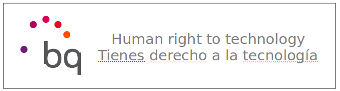
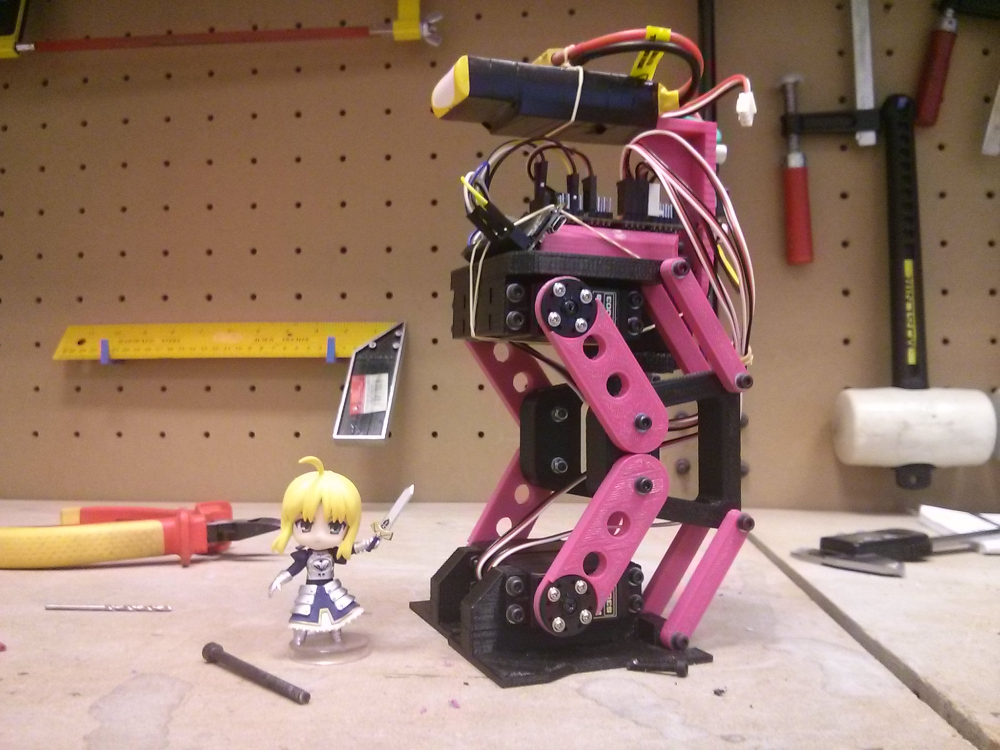

<table>
<tr>
<td>

</td>
</tr>
</table>

# MAUS

MAUS is an experimental biped walker with PLM legs. The main controller of this robot is an Arietta G25 Linux SBC. Main code for locomotion and gaits is written in Python using oscillator algorithms.

 

# License 

